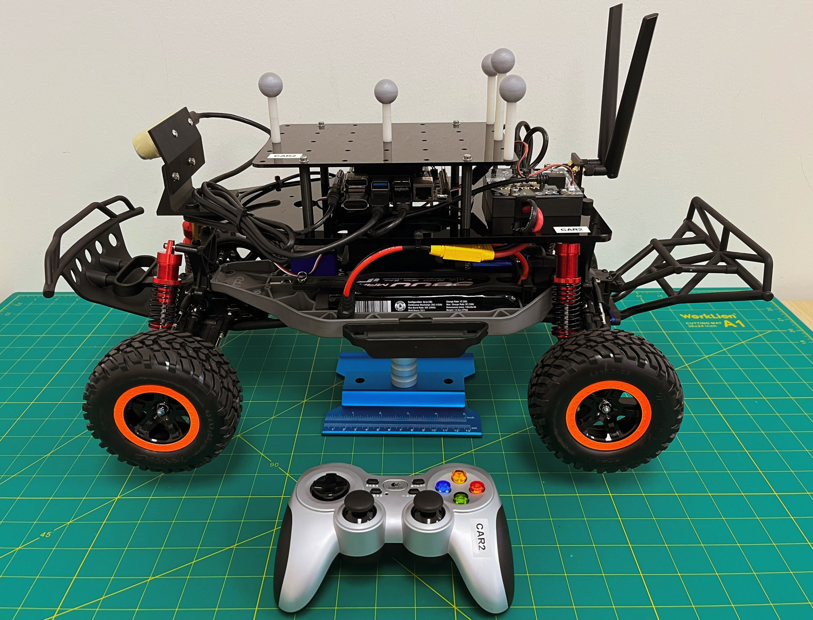
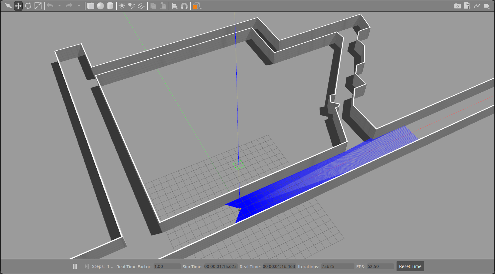
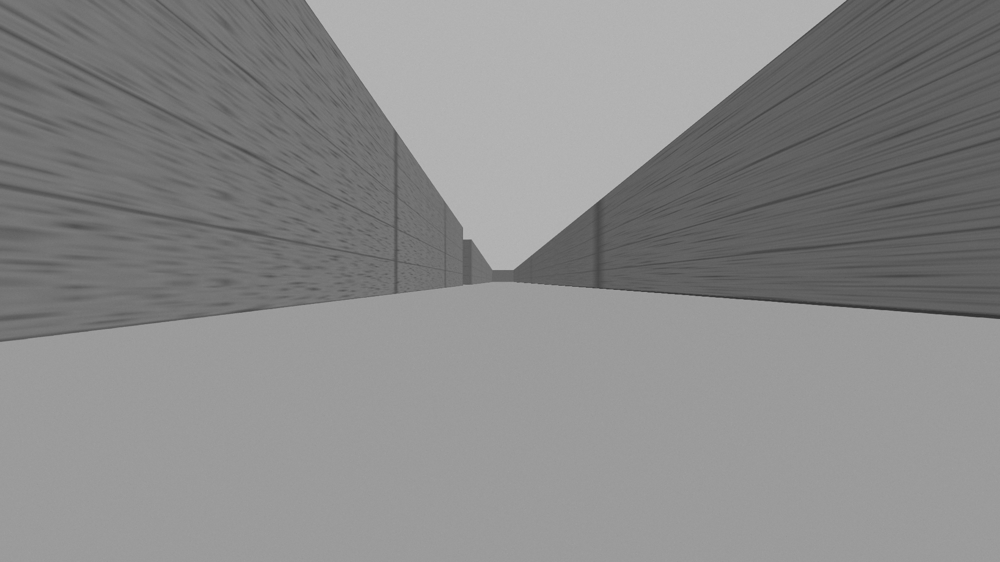
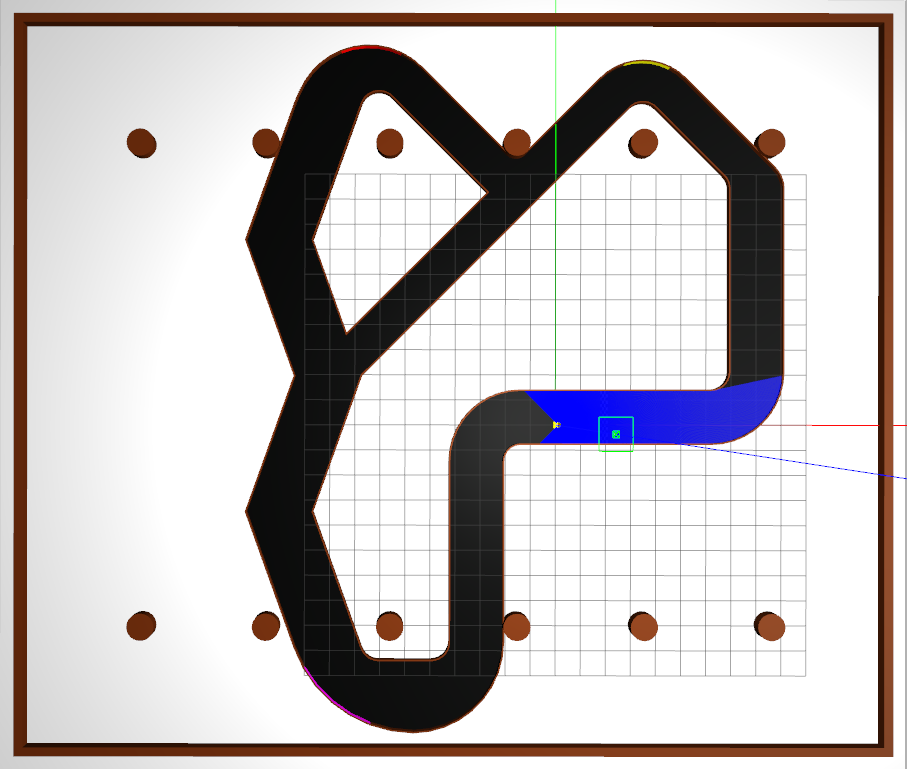
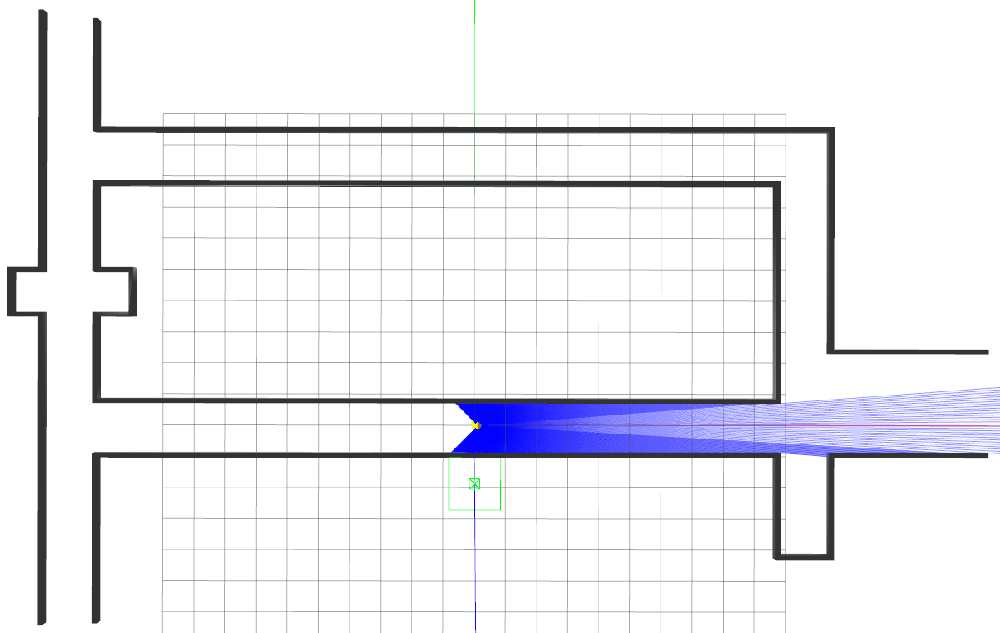
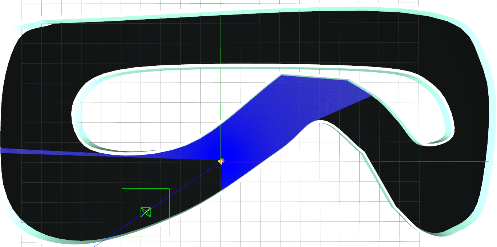
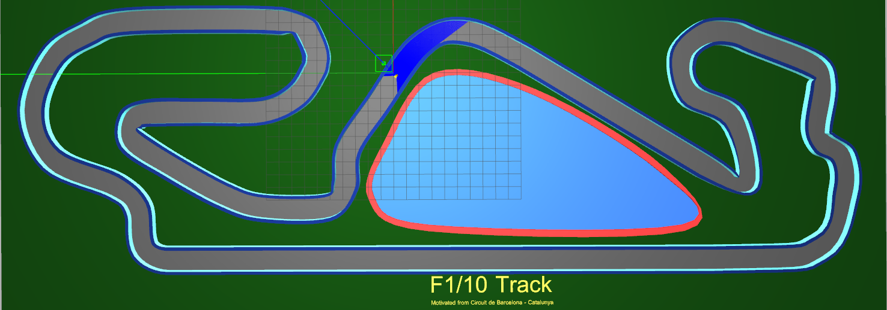

### Starter Code of F1TENTH Simulator for [ECE484](https://publish.illinois.edu/safe-autonomy/)

#### University of Illinois at Urbana-Champaign

#### System: Ubuntu 20.04 + ROS Noetic (Gazebo 11)

#### F1TENTH Racecar

  

#### Setup

$ sudo apt-get install -y ros-noetic-navigation ros-noetic-teb-local-planner* ros-noetic-ros-control ros-noetic-ros-controllers ros-noetic-gazebo-ros-control ros-noetic-ackermann-msgs ros-noetic-serial  

#### Tunnel Environment

$ source devel/setup.bash  
$ roslaunch f1tenth-sim racecar.launch world_name:=racecar_tunnel  

#### Walker Environment

$ source devel/setup.bash  
$ roslaunch f1tenth-sim racecar.launch world_name:=racecar_walker  

#### Levine Track Environment

$ source devel/setup.bash  
$ roslaunch f1tenth-sim racecar.launch world_name:=track_levine  

#### Porto Environment

$ source devel/setup.bash  
$ roslaunch f1tenth-sim racecar.launch world_name:=track_porto yaw:=0.75  

#### Barca Environment

$ source devel/setup.bash  
$ roslaunch f1tenth-sim racecar.launch world_name:=track_barca x:=-0.2 y:=-0.2 yaw:=-0.5  

#### Keyboard Teleop

$ source devel/setup.bash  
$ rosrun f1tenth-sim keyboard_teleop.py  

#### Reference

[f1tenth-dev/simulator](https://github.com/f1tenth-dev/simulator/tree/development)  

